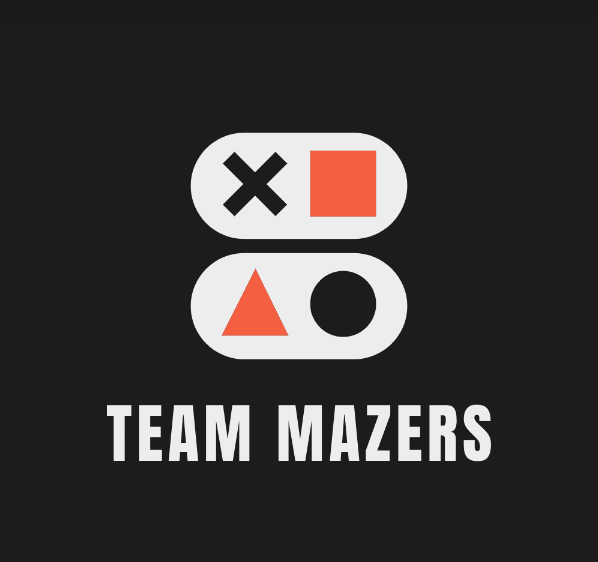
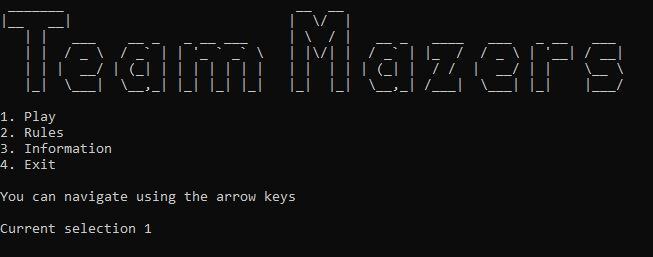
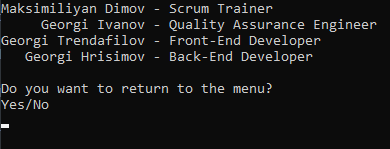
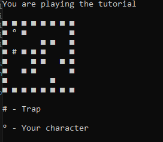
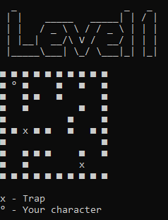

# Hello, we are Team Mazers!

## Description 📝
We are Team Mazers. The task is to create a C++ program based on a maze game. An essential is using dynamic arrays.

## Contributors 🧔

- Maksimiliyan Dimov 10 A *<MKDimov19@codingburgas.bg>* - Scrum Trainer

- Georgi Trendafilov 10 G *<GSTrendafilov19@codingburgas.bg>* - Front-end Developer

- Georgi Hrisimov 10 V *<GKHrisimov19@codingburgas.bg>* - Back-End Developer

- Georgi Ivanov 10 B *<GVIvanov19@codingburgas.bg>* - QA Engineer

## Links 🔗

* [Presentation]
* [Documentation](https://codingburgas-my.sharepoint.com/:w:/g/personal/mkdimov19_codingburgas_bg/EUJeRP2sSExPqqMEy0ubuiQB16rrfG9P-n-2nu_2p4k3uA?e=jThPbL)
* [QA_Documentation](https://codingburgas-my.sharepoint.com/:x:/g/personal/mkdimov19_codingburgas_bg/EQlULJr4gO5CmFOqBPDl1o4BR0I8nLmiHRc2o28-MOpjjg?e=3zP9cN)

## Screenshots 📷

**Menu**

**Information menu**

**Tutorial**

**Level 1**

